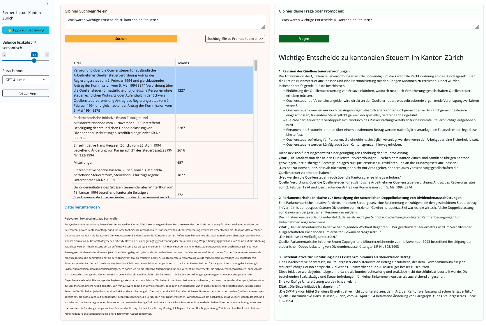

# Research Tool for Document Collections

**Perform intelligent research over document collections using hybrid search and LLMs.**


[](https://github.com/machinelearningZH/document-research-tool)
[](https://github.com/machinelearningZH/document-research-tool/stargazers)
[](https://github.com/machinelearningZH/document-research-tool/issues)
[](https://img.shields.io/github/issues-pr/machinelearningZH/document-research-tool)
[](https://github.com/machinelearningZH/document-research-tool)
<a href="https://github.com/astral-sh/ruff"></a>

<details>
<summary>Contents</summary>

- [Features](#features)
- [Installation](#installation)
- [Running the App](#running-the-app)
  - [Using Your Own Data](#using-your-own-data)
- [Project Information](#project-information)
- [Project Team](#project-team)
- [Feedback and Contributing](#feedback-and-contributing)
- [License](#license)

</details>



## Features

- **Hybrid search**: Combines lexical and semantic search.
- **Retrieve with chunks, generate with documents**: Finds relevant documents via chunks but lets you chat with whole documents.
- **User control**: Choose which documents to include in the LLM context.
- **Multiple LLM support**: Easily switch between hundreds of commercial and open-source models via [OpenRouter](https://openrouter.ai/).
- **Local usage**: Uses local embedding models and can be adapted for local LLMs.

## Installation

To install the project and its dependencies:

```bash
git clone https://github.com/machinelearningZH/document-research-tool.git
cd document-research-tool

pip3 install uv
uv venv
source .venv/bin/activate
uv sync
```

Creating and activating a virtual environment is optional when using uv. You can also start the app directly with the following command: `uv run shiny run research_app.py`

Please note that using this method may result in a noticeable delay before the app starts.

## Running the App

1. Fill in your configuration values in `utils_config.py`:
   - Set your `OPEN_ROUTER_API_KEY` (get one from [OpenRouter](https://openrouter.ai/)). Save the key in `.env_example` or change the file path/name to your `.env` file in `utils_config.py`.
   - Choose your preferred models and embedding settings.
   - Configure your available hardware in `EMBEDDING_PLATFORM`. You need to choose between `mps` for Apple Silicon, `cuda` for Nvidia GPUs or `cpu` for CPU-only systems. If you get `RuntimeError: PyTorch is not linked with support for mps/cuda devices` change to `cpu`.

2. Start the app:

```bash
shiny run research_app.py
```

The app will be available at `http://127.0.0.1:8000/`.

> [!TIP]
> To disable logging of user interactions, comment out the `log_interaction` function call in `research_app.py`.

> [!NOTE]
> Please note that we call OpenRouter with the [OpenAI SDK](https://openrouter.ai/docs/quickstart#using-the-openai-sdk) (which is a preferred way to do it).

### Using Your Own Data

- The app works out of the box with provided sample data (several hundred "Kantonsratsprotokolle" available as Open Government Data).
- To use your own documents, run `01_index_data.ipynb` to preprocess your data and create a [Weaviate](https://weaviate.io/developers/weaviate/installation/embedded) search index.
- By default, Weaviate index data is stored in `.local/share/weaviate/`.
- For remote deployment, copy the index data to the same path or adjust the path in the app: `client = weaviate.connect_to_embedded(persistence_data_path="/your_data_path_on_your_vm/")`

## Project Information

Many cantonal customers have large, mixed-source document collections and need smarter research tools. This template enables rapid prototyping and adaptation to different corpora.

- LLMs make mistakes, so we focus on **assistive systems that help domain experts with search and answer drafting**, but **not** do their work. Therefore we want to give users maximum control and transparency.
- Most RAG templates combine retrieval and generation, limiting user control. Our approach **separates search and answer generation**, letting users select which sources to submit to the LLM, resulting in higher-quality answers.
- We never ingest document collections blindly. Most project time is spent understanding user needs and preparing data.
- Intelligent search (lexical/semantic) alone often delivers significant value.
- We search via chunks but **provide full documents as context**. We find that this improves answers particularly in legal workflows where often whole documents like decisions need to be taken into account for good results.
- Most administrative data is confidential, so our pilots (and this template too) are designed for easy local, self-hosted deployment.
- [OpenRouter](https://openrouter.ai/) allows quick comparison of many hundreds [commercial and open-source LLMs](https://openrouter.ai/models), helping users assess answer quality for local deployments too.

## Project Team

**Chantal Amrhein**, **Patrick Arnecke** – [Statistisches Amt Zürich: Team Data](https://www.zh.ch/de/direktion-der-justiz-und-des-innern/statistisches-amt/data.html)

## Feedback and Contributing

We welcome feedback and contributions! [Email us](mailto:datashop@statistik.zh.ch) or open an issue or pull request.

We use [`ruff`](https://docs.astral.sh/ruff/) for linting and formatting.

Install pre-commit hooks for automatic checks before opening a pull request:

```bash
pre-commit install
```

## License

This project is licensed under the MIT License. See the [LICENSE](LICENSE) file for details.

## Disclaimer

This software (the Software) incorporates the open-source model `de_core_news` (the Model) from spacy.io and has been developed according to and with the intent to be used under Swiss law. Please be aware that the EU Artificial Intelligence Act (EU AI Act) may, under certain circumstances, be applicable to your use of the Software. You are solely responsible for ensuring that your use of the Software as well as of the underlying Model complies with all applicable local, national and international laws and regulations. By using this Software, you acknowledge and agree (a) that it is your responsibility to assess which laws and regulations, in particular regarding the use of AI technologies, are applicable to your intended use and to comply therewith, and (b) that you will hold us harmless from any action, claims, liability or loss in respect of your use of the Software.
